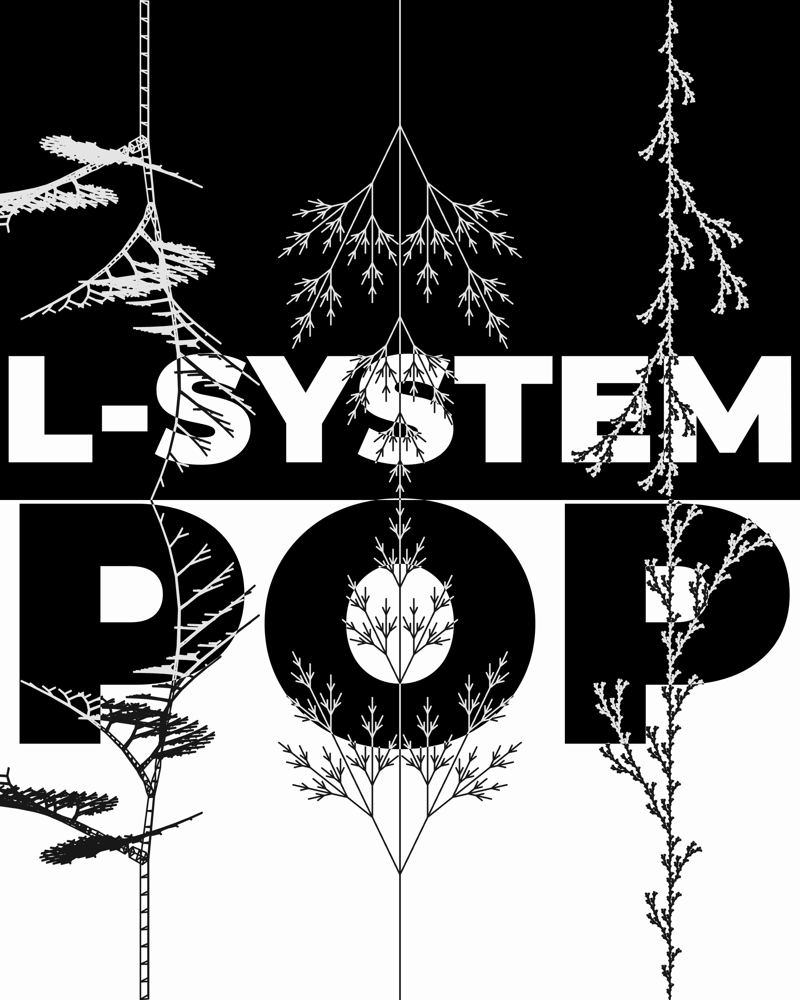
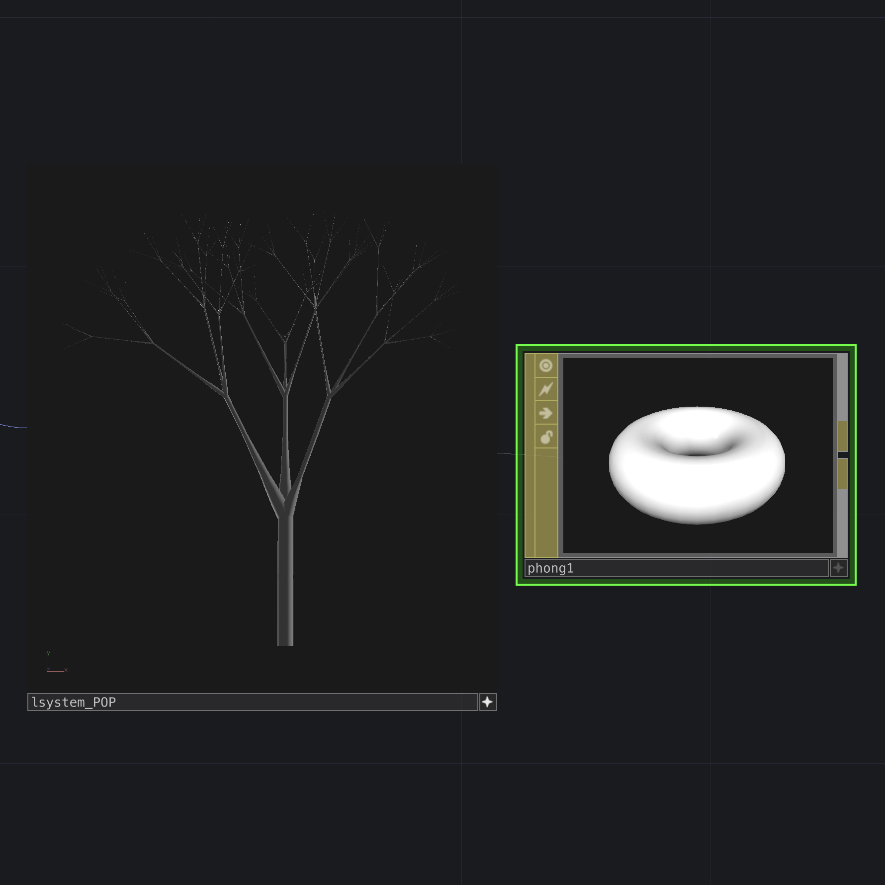
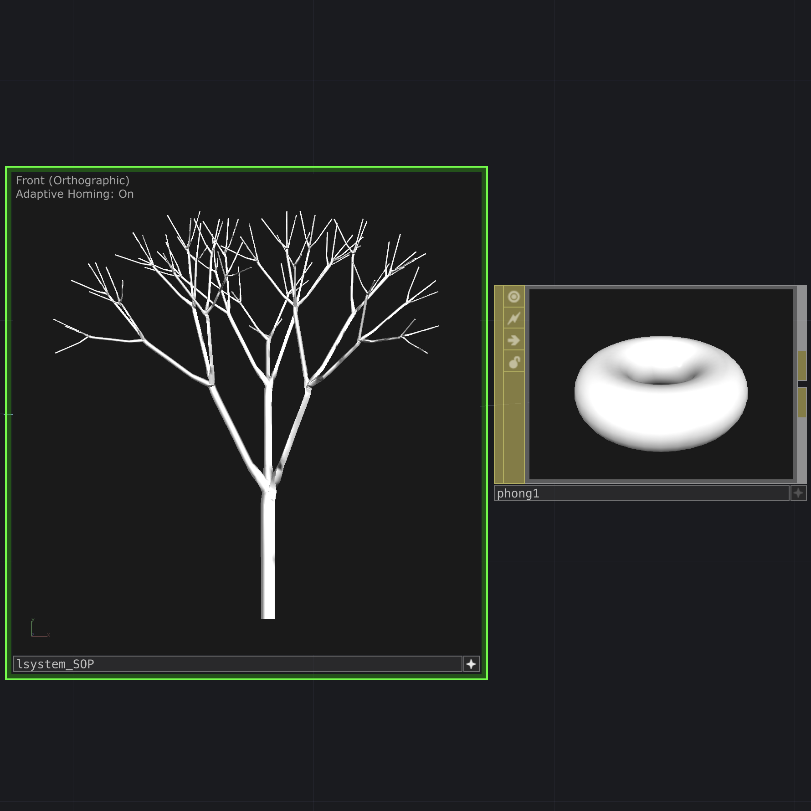
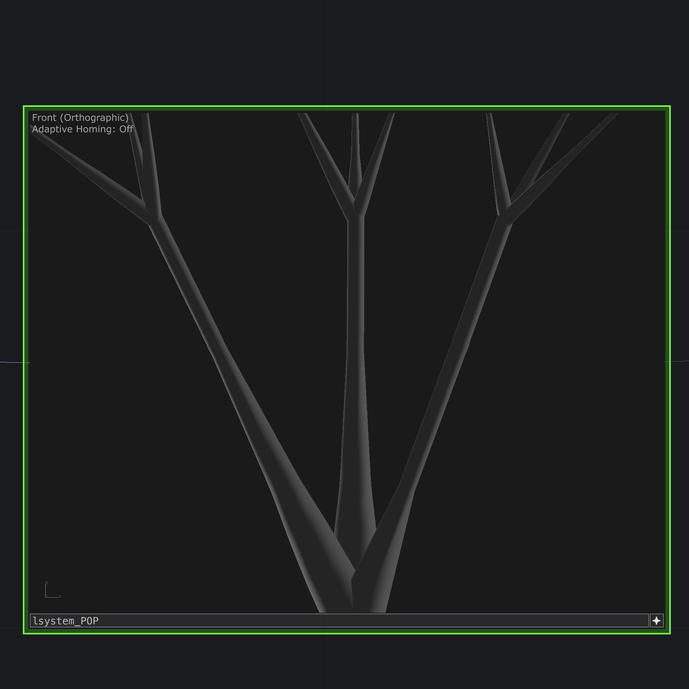
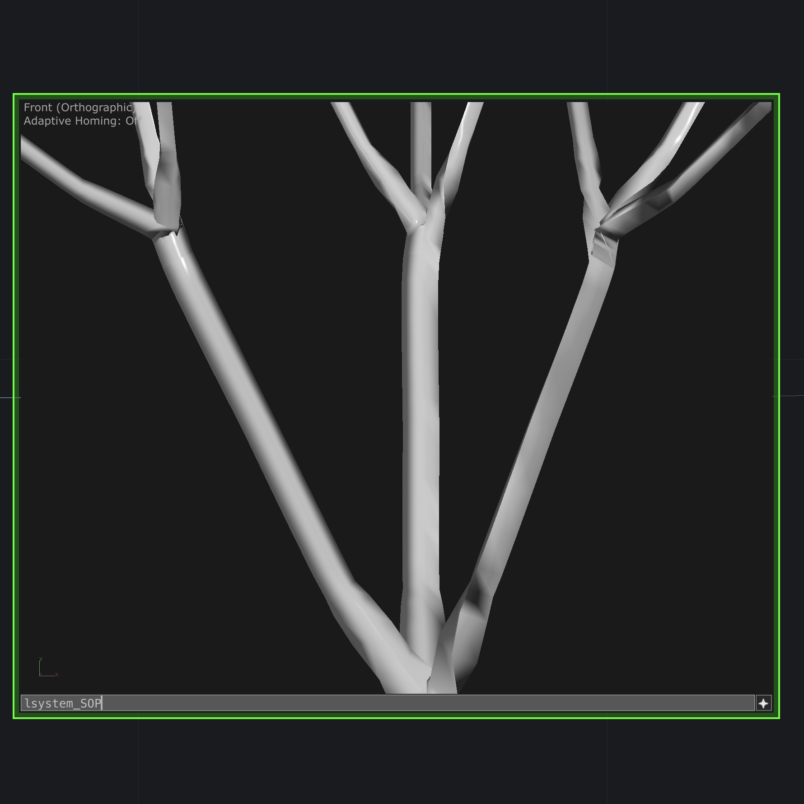
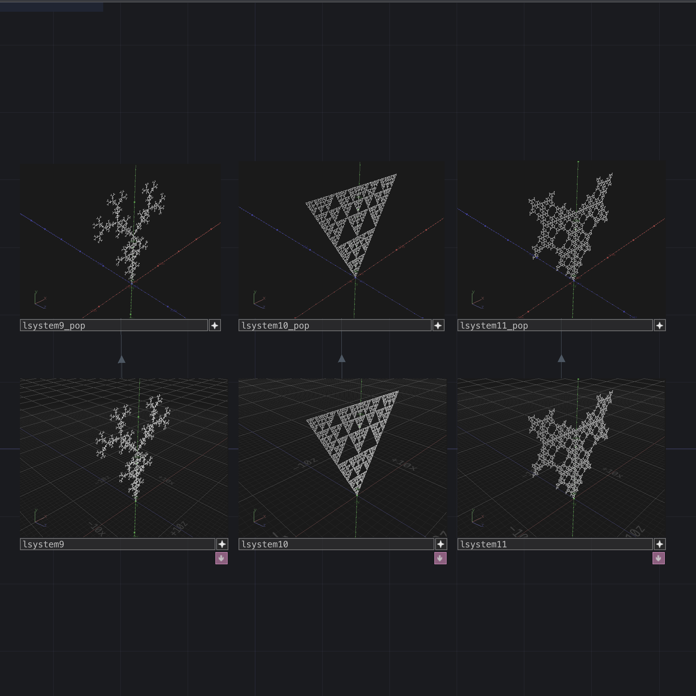
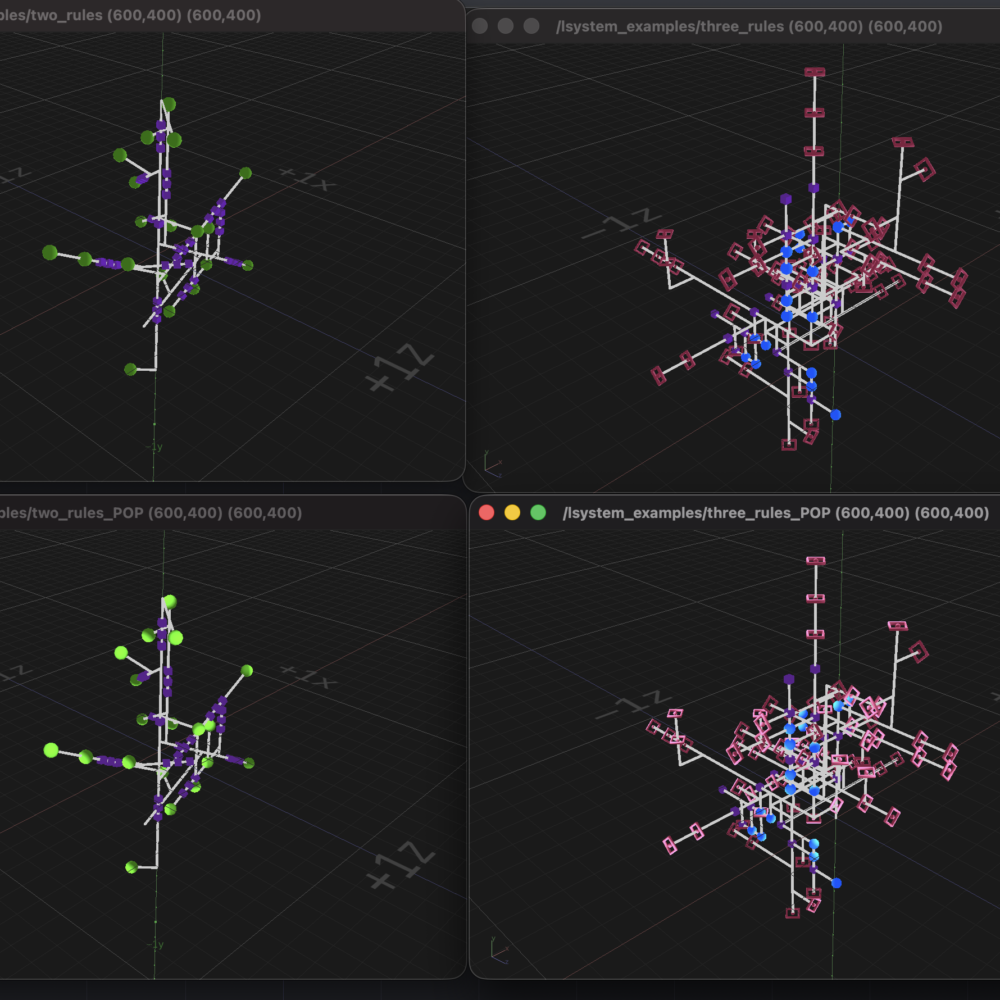

# L-System POP

Custom C++ POP for TouchDesigner: classic turtle L-System grammar in 3D.

## What It Does

- Builds procedural L-System geometry as a Point Operator
- Turtle alphabet in 3D (`FGH`, turns, brackets, tropism, and the rest of the usual set)
- **Topology:** `Points` or `Line Strip`
- **Type:** Skeleton or Tube (quads plus a tip cap)
- **Copy Mode:** `Bake` copies wired J/K/M meshes at the turtle; `Points` emits locators for a downstream `copyPOP`
- Three POP inputs map to turtle **J** / **K** / **M**
- **Async** offloads rewrite, turtle, and copies to a worker thread (one or more frames of delay)
- **Generations** is fractional; the same rules, seed, and Generations always give the same plant
- **Random Scale** / **Seed** on length, angles, and thickness
- Tube: **Rows**, **Columns**, **Tension**, **Branch Blend**, **Thickness**
- Grammar from a **Rules DAT** (disconnect the DAT to reload the default plant)
- Optional attributes (all default Off): `N`, `Tex`, `PointScale`, `LineWidth`, Turtle Group, Nesting, Stamp, Apply Color
- Pages: Geometry, Tube, Values, Attributes, About

## Same grammar

The native L-System SOP was the reference I already knew.

A side-by-side was inevitable: it is how I learned where a Custom POP can go further, and where the Custom Operator path still has limits.

Point Operators cannot emit a Mesh primitive, so the tube here is quads plus a cap.

The pictures use the same turtle grammar on this plant, so the two sides stay comparable.

|                                                            |                                                                                     |
| ---------------------------------------------------------- | ----------------------------------------------------------------------------------- |
|  **This POP**      |  **Native L-System SOP**       |
|  **This POP** |  **Native L-System SOP** |

## Libraries Used

- TouchDesigner POP C++ API

The implementation is original work. This plugin has no third-party engines or libraries.

## Requirements

- TouchDesigner 2025.33070 or later
- macOS (Apple Silicon) or Windows

The example `.toe` included in the release zip requires the same TouchDesigner build.

## How to Download this Repo

Download the latest release for your operating system (do not clone this repository to install the plugin):

- [Latest Release](https://github.com/Alaghast/L-System-POP/releases/latest)
- macOS: `Lsystempop-1.0.0-MAC.zip`
- Windows: `Lsystempop-1.0.0-WIN.zip`

Unzip the archive fully into a folder (for example `Lsystempop-1.0.0/`) **before** running Uninstall or the installer. Do not launch `.app`, `.pkg`, `.cmd`, or `.exe` files from inside the still-zipped archive.

## Installation

1. Unzip the release as described above.
2. **Uninstall first** to remove older copies (including previous drop-in plugins):
  - macOS: open `L-System Uninstall.app`
  - Windows: run `Lsystempop_Uninstall.cmd`
3. Run the installer like a normal application:
  - macOS: open `Lsystempop-TouchDesigner-1.0.0.pkg`
  - Windows: run `Lsystempop-TouchDesigner-1.0.0-win64.exe`
4. Fully quit and restart TouchDesigner.
5. When TouchDesigner shows the plugin scan dialog, click **Allow**. Clicking **Deny** will prompt again on every restart until the plugin is accepted.
6. Add an **L-System** POP from the **Custom** family in the OP Create Dialog.

The unzipped folder also contains `MANUAL.html`, `LICENSE.txt`, and `Lsystempop_Example_2025.33070.toe`.

### Plugin Locations

The installer places the plugin in the standard TouchDesigner Plugins directory, inside **AlaghastPOP**:

#### macOS

`/Users/<username>/Library/Application Support/Derivative/TouchDesigner099/Plugins/AlaghastPOP/`

#### Windows

`C:/Users/<username>/Documents/Derivative/Plugins/AlaghastPOP/`

#### Linux (Wine / Bottles)

This is not an official platform. 
On Wine, TouchDesigner does not list this Custom OP in OP Create. 
Custom OPs are verified with CryptoAPI; Wine does not cover that path, and Derivative has no bypass. 
Load the `.dll` from a **CPlusPlus POP** (`plugin` parameter). 
Setup notes: [experimental Bottles post](https://derivative.ca/community-post/experimental-setup-touchdesigner-linux-bottles/72962). 
Thanks to [@vtln_nltv](https://www.instagram.com/vtln_nltv/) for the test. Same workaround as Voronoi.

## Examples

### This zip

The zip includes `Lsystempop_Example_2025.33070.toe`.  

Open it after install.  

The gallery under `/project1` has **6 groups** and **24** small demos.

### The Algorithmic Beauty of Plants

*[The Algorithmic Beauty of Plants](https://archive.org/details/the-algorithmic-beauty-of-plants/mode/2up)* (Prusinkiewicz, Lindenmayer, 1990).

### DeRe

DeRe kindly allowed me to test this plugin inside their example file, which is available on her Patreon.  

Thank you, DeRe ([@bb.dere](https://www.instagram.com/bb.dere/)).  

Search L-System Basic from the [DeRe Patreon page](https://www.patreon.com/c/DeReVisuals/posts).

### Polyhop

Polyhop kindly allowed me to test this plugin inside their example file, which is available on his Patreon.  

Thank you, Polyhop ([@polyhop](https://www.instagram.com/polyhop/)).  

Search L-System Rule Builder from the [Polyhop Patreon page](https://www.patreon.com/cw/Polyhop).

## Distribution

- Installer: `.pkg` (macOS), `.exe` (Windows)
- Operator name: `Lsystempop` (label **L-System**)
- Version: `1.0.0`
- License: proprietary freeware (see [LICENSE](LICENSE))
- Author: [Edwin Lucchesi](https://www.edwinlucchesi.com/)

Source code is not included.

This software is an independent Custom Operator. It is not affiliated with, sponsored by, endorsed by, or an official product of Derivative Inc. It is not a replacement, substitute, or official port of Derivative's L-System SOP, or of any other Derivative operator. Similarity of turtle syntax or typical results does not make this plugin a Derivative product. TouchDesigner is a product of Derivative Inc.

## Share Your Results

If you use this plugin, feel free to tag me.
I'll be happy to see your results!

Instagram: [@Alaghast](https://www.instagram.com/alaghast/)

Want to support future plugins? [Patreon](https://www.patreon.com/Alaghast)

Want advanced features of this plugin later? [Ko-fi shop](https://ko-fi.com/alaghast/shop)

2025-26